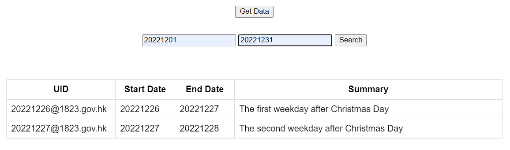

# Web App for HK Holidays

A Web application using `Java` `Spring` Framework and `MySQL` database, following Model-View-Controller (MVC) design pattern, which can parse the input Json file, store data to database and output the requested data to Web UI as the query requests.

<!-- a.	How to compile, start and test the application -->
## Instroduction


### Completed Features

A Web application for listing and searching HK holidays from 2021 to 2023<br>
&#9745; store the HK holidays in database <br>
&#9745; output the holiday list from database<br>
&#9745; filter & re-output the holiday list from database



### Setup

1. Start MySQL database in localhost
2. Create an empty  `hk_holidays` batabase
```sql
CREATE DATABASE `hk_holidays`;
```
3. Setup your username and password in class `DBHandler`
```java
public class DBHandler {

    // other attributes and constructor

    public void connectToDB(String requestedDbName){

        Properties properties = new Properties( );
        properties.put( "user", "xxx" );           // xxx: input your username
        properties.put( "password", "ooo" );       // ooo: input your password
}   }
```

### Compile & Start

1. In Linux or Terminal environment, complie & run this project in the depository where the `mvnw` file located, using Unix shell script of maven.

```
PS D:\holidays> ./mvnw package
PS D:\holidays> ./mvnw spring-boot:run
```
2. Open a web browser with url `http://localhost:8080/`

### Test

Utilised framework JUnit to perform the unit testing for controller, parsing Json and implementing database (Detials is mentioned in Work Diary section as well).
- JsonHandlerTest
- DBHandlerTest
- HolidaysApplicationTests
```
PS D:\holidays> ./mvnw test
```

### How to use

#### Press the 'Get Data' Button to start

- Web server will parse the Json file, store data to database and ouput all the holiday data from database to web UI


~~~


#### Input the 'Start Date' and 'End Date' and Press the 'Search' Button to filter data

- Date format: YMD (ex. 20210101)

- Set Start Date to 20221201 and End Date to 20221231, then press 'Search'

- Web server will output all the holiday within this time period from database to web UI


## Work Diary

### 12th Dec (1st Day)

1. **Planned for the project**: requested element, app architetecure, framework to use, check-points

2. **Setup architecture**
> It was the first project that I use Java for web app and DB implementation, but I have done another project with similar functionality in JavaScript. In this project, I learnt about Java MVC design pattern and managed to set the plan and architecture.

3. **Create a new `Spring-boot` project for web app**

4. **Design basic GUI with `home.html`**

5. **Built a class `HomeController` utilising `spring` framework to construct web bind**
    - a `GetMapping` for getting the home page 
    - a `GetMapping` for getting data from database as data model

6. **Built a class/model `Holday` for Java `MVC` design pattern**

7. **Built a `JsonHandler` class to parse Json file**
    - built the methods to read Json from URL, parse Json, and store all holiday data to memory space as Holiday objects
    - setup `org.json` dependency in `pom.xml`
    - use JUnit testing to ensure the functionality
> The process follows Test-driven development method. This helps me to break down problem during coding. Once I got stuck by how to correctly parse the Json, instead of compiling and running the entire project on web, the unit testing makes debugging easier and more efficient. 

### 13th Dec (2nd Day)

1. **Implement database `MySQL` with `java.sql` and `JDBC` driver**
    - Setup `JDBC` driver for MySQL
    - Setup methods data manipulation 
        - Create a new table in DB
        - Update/extract data from DB
    - JUnit testing

> Before this project, I have some experince in implementing SQL DB using C++, and I could built DBHandler smoothly. In this project, I've learnt about using 'information_schema' in MySql to check a table exists or not.

> Test-driven development is quite useful for coding and debugging. 

> For setting up JDBC driver using Java, I got some problem at the beginning. I searched online and check several ways that others suggested, and finally figured out adding a JAR file to the library.

2. **Desined UI using CSS stylesheet**
> For UI design, I only made the minimum elements work and leave some work due to the time limitation. In future work, the web design could be better. For example, in the case of larger amount of data, the output list can be seperated into several pages to improve the UI design.

> Another point that needs to be improved is the date filter. A better approach is with an actual calendar input rather than the current one that allows user to manually type dates. It could avoid the typing error by the users and invalid date formats, like '00210101' or '2021.1.1'.

3. **Optimise Java code**

### 14th Dec (3rd Day)

1. **Add a Get method in the class `HomeController` Utilising `springframework` to construct web bind**
    - a `GetMapping` for filtering data from database
> Due to the way to input filtering dates memtioned above, I didn't write any code to prevent invalid filter dates either. Even thought it won't generate errors, invalid inputs will still impact the usability. The perfect solution is to implement an UI to constrain the user input, like a calendar that users can pick up a date for filtering.

2. **Test the Controller for web app**
> In this project, I didn't complete enough tests due to time limitation. The test already implemented is to ensure the controller is generated normally by springframework.

> In future work, some unit testing could be performed to test the functionality for each getmapping or postmapping used in MVC. Integration testing could also used to test modelling various situations, like the operations by users.

> In this project, Only the basic using cases are considered due to time limitation. Some extreme cases could be considered for an actual system design, like multiple users, maximum length of holiday list, maximum length of holiday summary etc.

3. **Optimise code**

4. **Documentation**

---
### Future Work

1. Improve the reliability and flexibility
2. Unit Testing and Integration Testing
3. Improve web UI


Thank you
